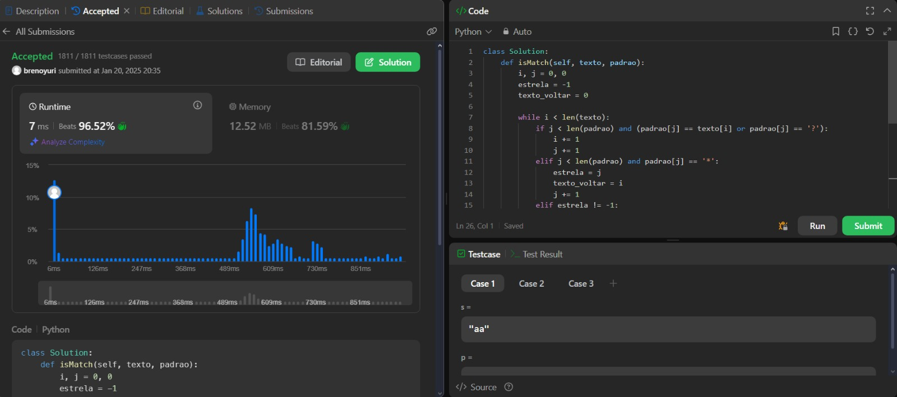

# Questions LeetCode

**Número da Lista**: 36 
**Conteúdo da Disciplina**: Greed 

## Alunos
|Matrícula | Aluno |
| -- | -- |
| 18/0098683 |  BRENO YURI BARBOSA GOMES |
| 21/1063176  |  JOYCE DIONIZIO DE MESQUITA |

## Sobre 
Esse projeto tem o objetivo de realizar problemas de média e alta complexidade no juíz LeetCode. Os exercícios serão resolvidos com base no conteúdo do conteúdo Greed.

## Apresentação

[Link da Apresentação](https://www.youtube.com/embed/lB6kVdxrcDY?si=7HjDBkAeTRawL3qt)

#### [45. Jump Game II](https://leetcode.com/problems/jump-game-ii/description/)
**Dificuldade:** Medium  
**Descrição:** O problema é resolvido com algoritmos ambiciosos, que buscam o menor número de saltos para alcançar o final do array, considerando o alcance máximo possível em cada etapa.  

#### [1402. Reducing Dishes](https://leetcode.com/problems/reducing-dishes/description/)
**Dificuldade:** Hard  
**Descrição:** Para resolver este problema usando um algoritmo ganancioso, a estratégia consiste em maximizar a soma dos coeficientes de tempo de satisfação. Para isso, é necessário ordenar as satisfações em ordem decrescente e organizar os pratos de forma que as maiores satisfações sejam multiplicadas pelos tempos mais elevados.

#### [2136. Earliest Possible Day of Full Bloom](https://leetcode.com/problems/earliest-possible-day-of-full-bloom/description/)
**Dificuldade:** Hard  
**Descrição:** O problema é determinar o dia mais cedo em que todas as sementes florescem, considerando os tempos de plantio e crescimento. A solução otimiza a ordem de plantio para minimizar o tempo total.  

#### [44. Wildcard Matching](https://leetcode.com/problems/wildcard-matching/description/)

**Dificuldade:** Hard  
**Descrição:** O problema pede para implementar um algoritmo que verifique se uma string (s) corresponde a um padrão (p) com curingas, onde:

- "?" corresponde a qualquer caractere único.
- "*" corresponde a qualquer sequência de caracteres (ou nenhuma).

O padrão deve corresponder à string inteira.

**Linguagem**: Python 
